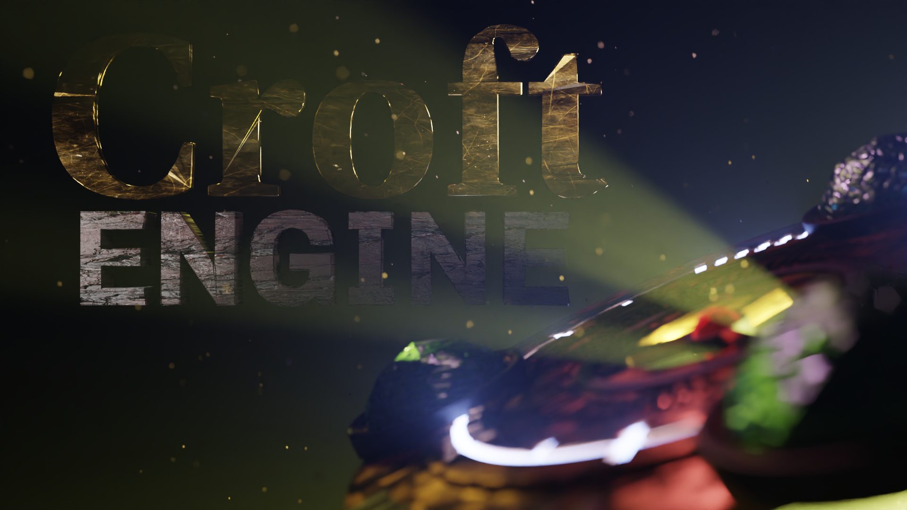

#  EdisonEngine

[](https://app.fossa.io/projects/git%2Bgithub.com%2Fstohrendorf%2FEdisonEngine?ref=badge_shield)
[](https://lgtm.com/projects/g/stohrendorf/EdisonEngine/alerts/)
[](https://lgtm.com/projects/g/stohrendorf/EdisonEngine/context:python)
[](https://lgtm.com/projects/g/stohrendorf/EdisonEngine/context:cpp)

An open-source Tomb Raider 1 engine remake.



## Licensing

EdisonEngine is an open-source engine distributed under LGPLv3 license, which means that ANY part of the source code
must be open-source as well.

[](https://app.fossa.io/projects/git%2Bgithub.com%2Fstohrendorf%2FEdisonEngine?ref=badge_large)

## Usage

**Important**: If you're not technically inclined, i.e. you don't know what 7z archives are, or how to use cmd or
powershell, this is *not* for you. As EdisonEngine is still in beta stage, there's no easy plug-and-play solution yet -
but it's planned.

Now, if you're still here, here's how to set up EdisonEngine and get it running.

1. Get the most recent release from [here](https://github.com/stohrendorf/EdisonEngine/releases).
2. Extract it. Be aware that there is *no* dedicated subfolder for all files, i.e. make sure you extract the files in a
   dedicated subfolder.
3. You will probably encounter bugs or strange oddities. Please don't think too much, report them immediately in
   the [issue tracker](https://github.com/stohrendorf/EdisonEngine/issues) here. I can't fix things I'm not aware of. If
   possible, attach screenshots (which are by default bound to F12) and instructions how to toggle that bug. If you
   can't reproduce the bug, at least try to be as specific as you can when describing the bug. Any information I can
   gather is in fact helpful to nail that bug down.
4. You need soundtrack files, grab them from [here](https://opentomb.earvillage.net/).
5. Ensure your data layout looks something like this:
   ```
   edisonengine.exe
   (... and other files from the release archive ...)
   data\
     tr1\
       AUDIO\
         002.ogg
         003.ogg
         ...
       DATA\
         CUT1.PHD
         CUT2.PHD
         ...
       FMV\
         CAFE.RPL
         CANYON.RPL
         ...
   ```
6. You should now be able to run `edisonengine.exe`. If something bad happens as mentioned above, or something doesn't
   work as expected, make a copy of `edisonengine.log`, and attach the file to the issue. You may also get help by
   [joining Discord](https://discord.gg/ndBqb5BmkH), I'll be there in the #edisonengine channel and chat with you as
   soon as I can, there are also other members already involved enough to give you some guidance.
7. The default keybindings are WASD for movement Q and E for stepping left and right, Space for jump, Shift for walking,
   X for rolling, Ctrl for Action, 1 for drawing pistols, 2 for shotguns, 3 for uzis and 4 for magnums. You can consume
   small medi packs by pressing 5, and large ones by pressing 6. Quicksaves and loading them can be done using F5 and
   F6. You can take screenshots by pressing F12. The menu can be opened using Esc, and videos can be skipped using Esc.

## Credits

The following people did extensive work on the [OpenTomb engine](http://opentomb.github.io/), which was the starting
point for EdisonEngine. Although EdisonEngine is a complete re-write with negligible remnants of OpenTomb's code base
and pretty much different goals, you can see the commit history of OpenTomb in this repository. Because of that - and
because I want to be grateful - I'd like to give credit to the OpenTomb contributors.

* [TeslaRus](https://github.com/TeslaRus): main developer.
* [Cochrane](https://github.com/Cochrane): renderer rewrites and optimizing, Mac OS X support.
* [Gh0stBlade](https://github.com/Gh0stBlade): renderer add-ons, shader port, gameflow implementation, state control
  fix-ups, camera and AI programming.
* [Lwmte](https://github.com/Lwmte): state and scripting fix-ups, controls, GUI and audio modules, trigger and entity
  system rewrites.
* Nickotte: interface programming, ring inventory implementation, camera fix-ups.
* [pmatulka](https://github.com/pmatulka): Linux port and testing.
* [richardba](https://github.com/richardba): Github migration, Github repo maintenance, website design.
* [Saracen](https://github.com/Saracen): room and static mesh lighting.
* [T4Larson](https://github.com/T4Larson): general stability patches and bugfixing.
* [vobject](https://github.com/vobject): nightly builds, maintaining general compiler compatibility.
* [vvs-](https://github.com/vvs-): testing, feedback, bug report.
* [xproger](https://github.com/xproger): documentation updates.
* [Banderi](https://github.com/Banderi): documentation, bugfixing.
* [gabrielmtzcarrillo](https://github.com/gabrielmtzcarrillo): entity shader work.
* [filfreire](https://github.com/filfreire): documentation.

Additional contributions from: Ado Croft (extensive testing), E. Popov (TRN caustics shader port), godmodder (general
help), jack9267 (vt loader optimization), meta2tr (testing and bugtracking), shabtronic (renderer fix-ups), Tonttu (
console patch) and xythobuz (additional Mac patches).

Translations by: Joey79100 (French), Nickotte (Italian), Lwmte (Russian), SuiKaze Raider (Spanish).

## Building

Do a `git submodule update --init --recursive`.

EdisonEngine uses [vcpkg](https://github.com/Microsoft/vcpkg); refer to its documentation for basic usage, but the only
thing you need is to call cmake with
`-DCMAKE_TOOLCHAIN_FILE=C:/devel/vcpkg/scripts/buildsystems/vcpkg.cmake` (adjust path as necessary).

This is the list of the required libraries to be installed with `vcpkg install` (remember to set the target triplet as
necessary, e.g. `vcpkg install boost:x64-windows`):

* boost
* glfw3
* libpng
* openal-soft
* opengl
* freetype
* cimg
* ffmpeg
* utfcpp
* gettext

...or use this, and adjust the triplet:
> `vcpkg install --triplet x64-windows boost glfw3 libpng openal-soft opengl freetype cimg ffmpeg utfcpp gettext`

## Generating Glad OpenGL bindings

**Warning!** The [Glad](https://glad.dav1d.de/) bindings have been manually patched to always try to load
the `GL_ARB_bindless_texture` extension, regardless of whether `GL_EXTENSIONS` reports it or not. This is to allow
debugging with [RenderDoc](https://github.com/baldurk/renderdoc/).

See [src/soglb/glad-patches.md](./src/soglb/glad-patches.md) for the applied patches.

### Generator Settings

Use the following settings to generate the bindings:

* OpenGL version 4.5, core profile
* No loader generation
* Do not omit KHR
* Local files
* Extensions:
    * GL_ARB_bindless_texture
    * GL_ARB_texture_filter_anisotropic
    * GL_ATI_meminfo
    * GL_EXT_texture_filter_anisotropic
    * GL_NVX_gpu_memory_info
