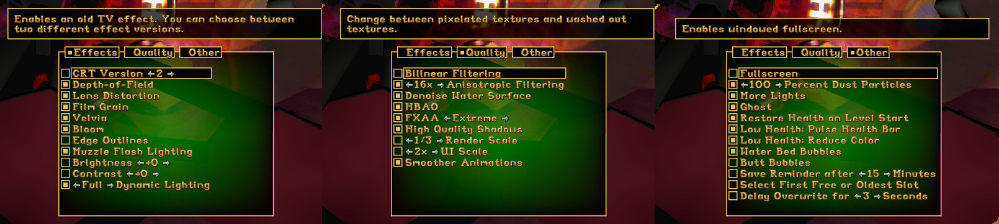

#  CroftEngine

# [Troubleshooting FAQ](https://github.com/stohrendorf/CroftEngine/wiki/FAQ)

You can also get support [on discord](https://discord.gg/FRAVaBZbY5).

[](https://github.com/stohrendorf/CroftEngine/actions/workflows/ci.yml)
[](https://github.com/stohrendorf/CroftEngine/actions/workflows/codeql.yml)
[](https://app.fossa.io/projects/git%2Bgithub.com%2Fstohrendorf%2FCroftEngine?ref=badge_shield)

An open-source Tomb Raider 1 engine remake.


<details>
<summary>Features (click to expand)</summary>

## Native Controller Support


## Native Glidos Texture Pack Support


## Easy Setup Wizard


## Customisable Graphics



## Extensive Statistics


## New Immersive Water


## Ghosts - Race Against Yourself!


</details>

<details>
<summary>Videos (click to expand)</summary>

## Tomb Raider: Croft Engine (JayStation & KittyPi3.14)

[](https://www.youtube.com/watch?v=7OZjvZ1CtE4)

## Showcase Trailer (Raina Audron)

[](https://www.youtube.com/watch?v=IAA6ILvQ4Uw)

## The Lost Valley Playthrough (Raina Audron)

[](https://www.youtube.com/watch?v=o8FEo1QU1QM)

## EdisonEngine - Tomb Raider, Enhanced! w/ developer commentary \[Beta 10\] \[PC\] \[Stream Archive\] (Dfactor Longplays)

[![EdisonEngine - Tomb Raider, Enhanced! w/ developer commentary \[Beta 10\] \[PC\] \[Stream Archive\]](https://img.youtube.com/vi/ayMPVAKTMWI/0.jpg)](https://www.youtube.com/watch?v=ayMPVAKTMWI)
</details>

<details>
<summary>Licensing (click to expand)</summary>

CroftEngine is an open-source engine distributed under LGPLv3 license, which means that ANY part of the source code
must be open-source as well.

[](https://app.fossa.io/projects/git%2Bgithub.com%2Fstohrendorf%2FCroftEngine?ref=badge_large)
</details>

<details>
<summary>Usage (click to expand)</summary>

**Avoid installing in the same folder as the original game.** Otherwise, weird stuff may happen. CroftEngine
pull in the data it needs from your original game data location. After you can confirm CroftEngine works, it
is safe to delete the original Tomb Raider installation, as CroftEngine doesn't need that anymore to run.

> *A user manual has been kindly provided by Raina
Audron [here](https://drive.google.com/file/d/1iRz4Svdi_dhmlDNFYeZqyP-wfApWhDoN/view)*.

> ***Please note that as of Beta 15 a setup assistant is included that should start if anything is missing.***

1. Get the most recent release from [here](https://github.com/stohrendorf/CroftEngine/releases). It is recommended to
   use the installer in Windows. For openSUSE users, the engine is available for most distribution versions in the
   "Games" repository.
2. You will possibly encounter bugs or strange oddities. Please don't think too much, report them immediately in
   the [issue tracker](https://github.com/stohrendorf/CroftEngine/issues) here. I can't fix things I'm not aware of. If
   possible, attach screenshots (which are by default bound to F12) and instructions how to toggle that bug. If you
   can't reproduce the bug, at least try to be as specific as you can when describing the bug. Any information I can
   gather is in fact helpful to nail that bug down.
3. You need soundtrack files, grab them from [here](https://opentomb.earvillage.net/).
4. On Windows, navigate to `%LOCALAPPDATA%` and create a directory `croftengine` there; on Linux, navigate
   to `~/.local/share` and create a directory `croftengine` there.
5. Ensure your the files in the newly created directory look something like this:
   ```
   croftengine
   └ data
     └ tr1
       ├ AUDIO
       │ ├ 002.ogg
       │ ├ 003.ogg
       │ └ ...
       ├ DATA
       │ ├ CUT1.PHD
       │ ├ CUT2.PHD
       │ └ ...
       └ FMV
         ├ CAFE.RPL
         ├ CANYON.RPL
         └ ...
   ```
6. You should now be able to run CroftEngine. If something bad happens as mentioned above, or something doesn't work as
   expected, use the "Bug Report" action, usually bound to F1. This will create a time-stamped folder in your user data
   dir, including a screenshot, a save of your game when you used that action, and a series of log files. Have these
   files ready when you want help, as they greatly improve chances of diagnosing the problem.
7. The default keybindings are WASD for movement Q and E for stepping left and right, Space for jump, Shift for walking,
   X for rolling, Ctrl for Action, 1 for drawing pistols, 2 for shotguns, 3 for uzis and 4 for magnums. You can consume
   small medi packs by pressing 5, and large ones by pressing 6. Quicksaves and loading them can be done using F5 and
   F6. You can take screenshots by pressing F12. The menu can be opened using Esc, and videos can be skipped using Esc.

</details>

<details>
<summary>Additional Cheats (click to expand)</summary>

Additionally to the standard cheats (step forward, step backwards, rotate slightly more than 1.5 rotations, and jump
forward/backward), there are two additional cheats.

1. If the final move is a left jump, you will get 5 small and 5 large medi packs. The successful application of this
   cheat will be confirmed with Lara sighing.
2. If the final move is a right jump, every enemy's health in the level will be halved. The successful application of
   this cheat will be confirmed with a shotgun shooting sound.

</details>

<details>
<summary>Effects (click to expand)</summary>

*Reference*


*Anisotropy disabled* - look at the snow on the wall to the right


*Bilinear filtering* - blurs the textures


*Bloom* - bright areas will slightly spread their light to neighboring areas


*Brightness*


*Contrast*


*CRT Version 1*


*CRT Version 2*


*Dust Particles disabled* - the reference has Dust Particles enabled, this is how it looks when it's turned off


*Partial Dynamic Lighting*


*Mostly Dynamic Lighting*


*Full Dynamic Lighting*


*Edge Outlining*


*Film Grain* - barely visible in-game


*FXAA disabled* - anti-aliasing, this is how it looks when disabled


*HBAO disabled* - darkens corners, look at the snow where the floor hits a wall, this is how it looks when disabled


*Lens Distortion*


*Muzzle Flash Lighting*


*Render Scale half* and *UI Scale* - half render scale, UI Scale is the same, but only affects the UI


*Shadow Quality disabled* - improves performance when disabled, but reduces the visual quality


*Velvia* - increases color saturation


*Depth of Field* - slightly blurs everything outside the focus point, which is at the center of the screen


</details>

<details>
<summary>Credits & Noteworthy People (click to expand)</summary>

The following people deserve some noteworthy credit.

* Raina Audron for creating the first YouTube videos and writing the user manual.
* [Martin Hauke](https://build.opensuse.org/users/mnhauke) for being the package maintainer of the openSUSE packages.
* [Liinx86](https://www.twitch.tv/liinx86) for being the world's first streamer streaming CroftEngine on twitch; also
  gave the idea for the Ghost feature.
* Liinx86 *again* for being the first person of playing from start to finish. A summary of the stream can be
  found [here](https://www.youtube.com/watch?v=P20YoVw2W6E), courtesy
  of [jaaystation](https://www.twitch.tv/jaaystation).
* [Tomb_of_Ash](https://www.twitch.tv/tomb_of_ash) for being the second streamer.
* [Dfactor Longplays](https://www.youtube.com/channel/UCwLhYb4QDAzQfzbhAHGKjgQ) for showing that the Corner Bug works.
* All testers reporting bugs.
* Every contributor.
* All players.

The following people did extensive work on the [OpenTomb engine](http://opentomb.github.io/), which was the starting
point for CroftEngine. Although CroftEngine is a complete re-write with negligible remnants of OpenTomb's code base
and pretty much different goals, you can see the commit history of OpenTomb in this repository. Because of that - and
because I want to be grateful - I'd like to give credit to the OpenTomb contributors.

* [TeslaRus](https://github.com/TeslaRus): main developer.
* [Cochrane](https://github.com/Cochrane): renderer rewrites and optimizing, Mac OS X support.
* [Gh0stBlade](https://github.com/Gh0stBlade): renderer add-ons, shader port, gameflow implementation, state control
  fix-ups, camera and AI programming.
* [Lwmte](https://github.com/Lwmte): state and scripting fix-ups, controls, GUI and audio modules, trigger and entity
  system rewrites.
* Nickotte: interface programming, ring inventory implementation, camera fix-ups.
* [pmatulka](https://github.com/pmatulka): Linux port and testing.
* [richardba](https://github.com/richardba): Github migration, Github repo maintenance, website design.
* [Saracen](https://github.com/Saracen): room and static mesh lighting.
* [T4Larson](https://github.com/T4Larson): general stability patches and bugfixing.
* [vobject](https://github.com/vobject): nightly builds, maintaining general compiler compatibility.
* [vvs-](https://github.com/vvs-): testing, feedback, bug report.
* [xproger](https://github.com/xproger): documentation updates.
* [Banderi](https://github.com/Banderi): documentation, bugfixing.
* [gabrielmtzcarrillo](https://github.com/gabrielmtzcarrillo): entity shader work.
* [filfreire](https://github.com/filfreire): documentation.

Additional contributions from: Ado Croft (extensive testing), E. Popov (TRN caustics shader port), godmodder (general
help), jack9267 (vt loader optimization), meta2tr (testing and bugtracking), shabtronic (renderer fix-ups), Tonttu (
console patch) and xythobuz (additional Mac patches).

Translations by: Joey79100 (French), Nickotte (Italian), Lwmte (Russian), SuiKaze Raider (Spanish).
</details>

<details>
<summary>Building on Windows (click to expand)</summary>

Do a `git submodule update --init --recursive`.

CroftEngine uses [vcpkg](https://github.com/Microsoft/vcpkg) **on Windows**; refer to its documentation for basic usage,
but the only
thing you need is to call cmake with
`-DCMAKE_TOOLCHAIN_FILE=C:/devel/vcpkg/scripts/buildsystems/vcpkg.cmake` (adjust path as necessary).

This is the list of the required libraries to be installed with `vcpkg install` (remember to set the target triplet as
necessary, e.g. `vcpkg install boost:x64-windows`):

* boost
* glfw3
* libpng
* openal-soft
* opengl
* freetype
* ffmpeg
* utfcpp
* gettext\[tools]
* libarchive
* libjpeg-turbo

...or use this, and adjust the triplet:
> `vcpkg install --triplet x64-windows boost glfw3 libpng openal-soft opengl freetype ffmpeg utfcpp gettext[tools] libarchive libjpeg-turbo`

An installation of [Qt 5](https://www.qt.io) is also necessary; as manually downloading and installing this
package is usually faster than letting it build through vcpkg, it is not included in the above list. If you don't want
to register for a Qt online account, you have to build it yourself, though, by installing the `qt5` and
`qt5-translations` vcpkg packages.

Finally, you need a [Python 3](https://www.python.org) installation; the one provided by vcpkg does not work. The
minimum supported version is Python 3.6, the Windows releases ship with Python 3.8. Other versions are not tested. To
build CroftEngine on Windows with an external Python installation, you need to add the variable `Python3_ROOT` pointing
to the installation root, e.g. using the command line with `-DPython3_ROOT=E:\Python38` or adding a path variable in the
ui.
</details>

<details>
<summary>Building on Linux (click to expand)</summary>

Do a `git submodule update --init --recursive`.

CroftEngine will download and cache some 3rd party libraries which are uncommon or usually outdated on today's popular
Linux distributions.

This is the list of the required libraries to be installed (these are *not* package names, but should be similar):

* boost
* glfw3
* libpng
* openal-soft
* opengl
* freetype
* ffmpeg
* utfcpp
* gettext
* libarchive
* libjpeg-turbo
* qt5
* python3 >= 3.6

You can have a look at
the [openSUSE RPM spec](https://build.opensuse.org/package/view_file/games/croftengine/croftengine.spec) for RPM-based
packages or the [CI file](https://github.com/stohrendorf/CroftEngine/blob/master/.github/workflows/ci.yml) for
Debian-based packages.
Depending on your distribution, the package names may differ.

Then follow the common `cmake` steps to build, i.e. `mkdir build && cd build && cmake .. && make`.
</details>

<details>
<summary>Generating Glad OpenGL bindings (click to expand)</summary>

**Warning!** The [Glad](https://glad.dav1d.de/) bindings have been manually patched to always try to load
the `GL_ARB_bindless_texture` extension, regardless of whether `GL_EXTENSIONS` reports it or not. This is to allow
debugging with [RenderDoc](https://github.com/baldurk/renderdoc/).

See [src/soglb/glad-patches.md](./src/soglb/glad-patches.md) for the applied patches.

### Generator Settings

Use the following settings to generate the bindings:

* OpenGL version 4.5, core profile
* No loader generation
* Do not omit KHR
* Local files
* Extensions:
    * GL_ARB_bindless_texture
    * GL_ARB_texture_filter_anisotropic
    * GL_EXT_texture_filter_anisotropic
    * GL_AMD_debug_output

</details>
